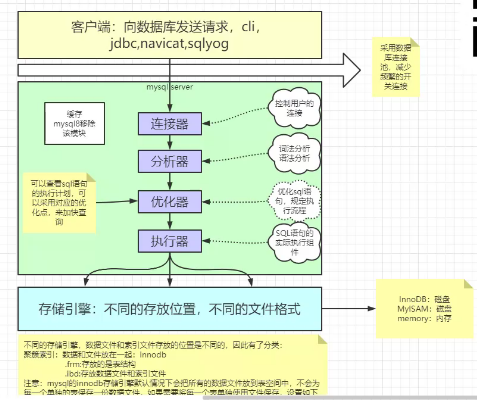

# mysql事务
1. 事务是构成单一逻辑工作单元的操作集合
2. 对一个或多个数据库操作
3. 一个事务一起成功一起失败
4. acid
5. 原子性，通过快照实现
6. 隔离性：并发的事务之间相互不影响，通过锁实现
7. 持久性：事务一旦提交，数据就持久化了，从内存到磁盘了，write ahead log。
8. 一致性：事务的根本追求

## 快照 undo log
1. 数据库日志：undo\redo\bin\relay\slow log
2. undo\redo ->innodb  bin ->server层
3. 原子性实现原理：undo log，在innodb中
4. undo log还实现MVCC，多版本并发控制
5. 数据库做任何动态操作时，都将数据备份到undo log
6. undo log 是逻辑日志，可以理解为

## 持久性原理：redo log
1. redo log记录的是新数据的备份，不管事务是否提交都会记录下来
2. 事务提交前，先持久化redo log
3. redo log buffer->OS buffer->fsync()->redo log file
4. 
5. 
6. 在实例和介质失败（media failure）时，redo log文件就能派上用场，如数据库掉电，InnoDB存储引擎会使用redo log恢复到掉电前的时刻，以此来保证数据的完整性。

## 隔离级别
1. 脏读：一个事务中读取到其它事务未提交的数据
2. 不可重复读：一个事务中读取到其它事务已提交的数据。一个事务中的多次查询数据不一致
3. 幻读（幻象数据）：

## MVCC
1. RC读最新的快照，RR读旧的快照，
2. 所有表有不可见3列createtime，deleteTime
3. 一个事务查询时，返回  createTime=<当前事务版本号&&(deleteTime==null||deleteTime>=当前事务版本号)  的数据

## 锁
#### innodb加锁是锁索引，只有在通过索引查询时加锁为行锁，否则使用全表扫描为表锁。
1. 间隙锁：为解决幻读引入  [MYSQL（04）-间隙锁详解](https://www.jianshu.com/p/32904ee07e56)
2. 独占、排他：是写锁
3. 共享锁：读锁，只能读，不能写
4. 临键锁：间隙锁+行锁，实现可重复读
5. 自增锁：自增主键插入失败也会增加，数据库保证自增用的
6. 意向锁：细粒度锁向粗粒度锁妥协

## 索引
### 聚簇索引与非聚簇索引
1. 聚簇索引，索引信息与数据信息放在同一个文件中。Innodb，frm，ibd
2. 非聚簇索引，索引信息与数据信息分两个文件存储。MyISAM。MYD（数据），MYI（索引），frm（表信息）
### 索引分类
3. 索引分类：主键索引、唯一索引、普通索引、全文索引、组合索引
4. 主键索引。使用主键作为索引key，不可以有空值
5. 唯一索引。一个唯一键作为索引，可以出现空值
6. 全文索引。对数据中部分字进行索引
7. 组合索引。以某几个键联合作为一个索引，一般在经常使用几个字段作为搜索条件情况下建
### 索引名词
8. 回表：索引结构是B+树，在索引中查到的数据一般是需要数据的主键值，所以又会查主键索引，被称为回表
9. Innodb也有hash索引：自适应hash。mysql只有Memmory引擎显式使用hash索引
10. 页：数据加载的最小单元，有4K、8K、16K（Innodb）
11. B+tree:索引的数据结构，特点：以主键索引为例，索引的除主键外数据都储存在叶子节点、叶子节点形成一个环形双向链表。优点：减少树高，减少IO次数，适合范围查找。一般树高为3-4层，支持千万级数据
12. 索引覆盖：一个表可以有多个B+tree（索引），但只有一棵树的子节点存储全量行数据，其它索引的叶子节点都是该树的key。其它索引查找完都要到这棵树进行回表，除非需要的数据在索引中就存在，即索引覆盖
13. 所有表建表时都有索引，没有设置则会有一个6字节rowid作为索引key，该行用户不可见
14. 最左匹配：组合索引匹配必须从左边开始，出现未匹配到或模糊匹配，都将使之后的字段匹配失效,。注：where写的顺序未必是执行顺序，优化器会调整
15. 索引下推：5.6之前，组合索引会先按照最左字段获得数据，然后再server层进行筛选，5.6之后，按照所有字段查找数据，然后直接返回
16. 优化器：CBO，基于成本的优化。RBO，基于规则的优化。
 
### 优化细节
1. 当使用索引列，字段不要使用表达式/函数，索引会失效
2. 尽量使用主键索引，因为不会触发回表。建议一定主键且自增，减少索引维护
3. 使用前缀索引，以字符串做索引，可以取部分作为索引，用left测试，使各字段分布较为均匀
4. 使用索引扫描排序
5. union，or，in，all都可以使用索引，但推荐使用in
6. 范围列可以使用索引
7. 强制类型转换会使索引失效，全表扫描
8. 更新十分频繁，数据区分度不高的字段不宜建索引，区分度在80%以上可以建索引
9. 创建索引的列，不允许为null，可能会有不符合预期的结果，null的判断特殊。mybatis里将0作为null
10. 表连接尽量不要超过三张表。增加部分数据冗余可以，范式与反范式混合
11. 尽量使用limit
12. 索引不是越多越好，不要在不了解系统情况下过早优化